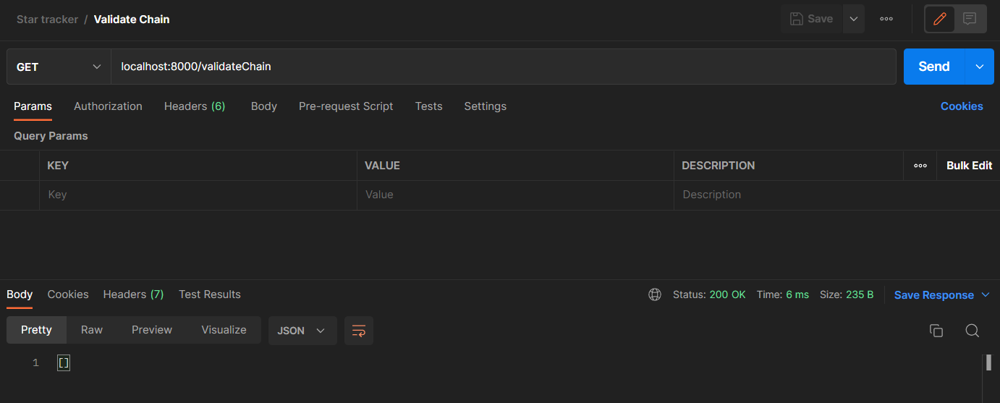
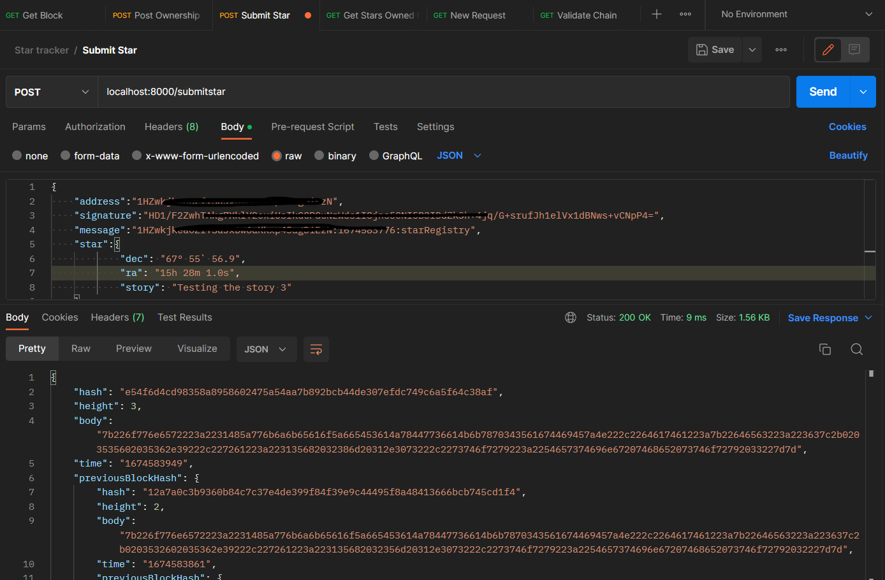

# Private Blockchain App

This application allows many users to register stars, and track the ownership of each star.

## How to run this app?

Clone || download the repo and follow next steps

Build the image <code>docker build -t boilerplatex . </code>  
Run the image and app <code>docker run -t -d -p 8000:8000 boilerplatex </code>  
List the running containers<code>docker ps </code>

If you won't use the app you can stop the container  
<code>docker stop **(first 2 container name characters) </code>

After the app || container is running ...

## Test the app 

Download and install Postman
 

### 1.- Make sure the app is working fine and it creates the Genesis Block.

GET <code>localhost:8000/block/0</code>

<figcaption>Block 0</figcaption>

### 2.- Make the first request of ownership sending your wallet address.

POST <code>localhost:8000/requestValidation</code>

Body settings: raw, JSON

<figcaption>Validation</figcaption>

 

### 3.- Sign the message with your Wallet. 

* You can use Bitcoin Testnet app.

* If you face issues with any local app, try to sign a message with  <a href = "https://reinproject.org/bitcoin-signature-tool/#sign">Online bitcoin signature tool.</a>

<figcaption>Signature</figcaption>

 

### 4.- Submit your Star.

POST <code>localhost:8000/submitstar</code>

Body settings: raw, JSON

<pre>
<code>
{
    "address":"1HZwkjkeaoZxxxxxxxxxxkxp45agDiEzN",
    "signature":"HFxxxxxjQKc//wKvBxxxxxxxxxxx7Fyu2lQzgEAvP4sJxxxxxxxxxxCHww263/LFgCMfA4A********eI45u6M=",
    "message":"1Hxxxxxkjkeaoxxxxxxxp45agxxxxzN:1659920690:starRegistry",
    "star":{
            "dec": "68° 52` 56.9",
            "ra": "16h 29m 1.0s",
            "story": "Tsting the story 2"
            }
}
</code>
</pre>

<figcaption>Submitt a star</figcaption>

 

### 5.- Validate the chain.

GET <code>localhost:8000/validateChain</code>

<figcaption>Validate chain</figcaption>

 

### Optional.- Retrieve Stars owned by me.

GET <code>localhost:8000/blocks/1HxxxxxkeaoZ*****************EzN</code>

<figcaption>Retrieve owned info</figcaption>

 

### Optional.- Retrieve a star by it's hash.

GET <code>localhost:8000/block/hash/48************************************db779f73bcc3357faa</code>

<figcaption>Get star by hash</figcaption>

 
 

 
Thanks!

